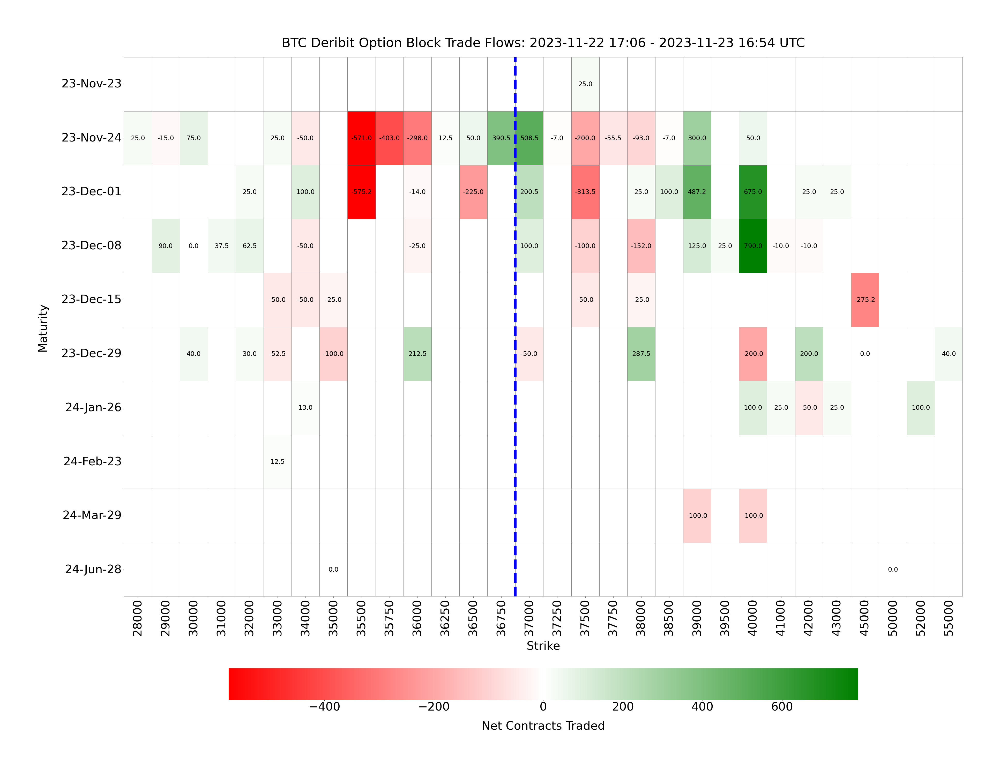

# Deribit Block Option Trade Heatmap Tracker

This Python script visualizes the flow of block option trades on Deribit for BTC or ETH using a heatmap. It fetches historical trade data, processes it, and generates a heatmap to analyze trade flows based on maturity and strike prices.

## Usage
1. Initialization: Create an instance of the HeatMap class.

``` python
from option_flows import HeatMap
heatmap = HeatMap(asset='BTC', lookback_hours=24)
```
- **asset**: The cryptocurrency asset, either 'BTC' or 'ETH'.
- **lookback_hours**: The number of hours to look back for trades.

2. Fetching and Cleaning Data: The class automatically fetches and processes the trade data when generating the heatmap.

3. Generating the Heatmap:
```python
heatmap.plot_data()
```
This method fetches the data, cleans it, and plots the heatmap. The heatmap shows option trade flows with maturity dates on the y-axis and strike prices on the x-axis.

4. Result: The script saves a heatmap image visualizing the trade flows during the specified lookback period.

## Examples
**Example 1**: Bitcoin 24-Hour Trade Flow
``` python
btc_heatmap = HeatMap(asset='BTC', lookback_hours=24)
btc_heatmap.plot_data()
```
Generates and saves a heatmap for Bitcoin option trades over the past 24 hours.


**Example 2**: Ethereum 48-Hour Trade Flow
```python
eth_heatmap = HeatMap(asset='ETH', lookback_hours=48)
eth_heatmap.plot_data()
```
Generates and saves a heatmap for Ethereum option trades over the past 48 hours.


## Dependencies

To use the `HeatMap` class, ensure you have the following Python libraries installed. You can install all required dependencies via `pip` with this command:

```bash
pip install pandas numpy requests matplotlib seaborn
```

## Conclusion
This script provides an insightful visualization of the block option trades on Deribit for BTC and ETH, aiding in the analysis of market trends and trader behavior.


